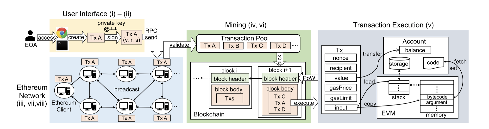
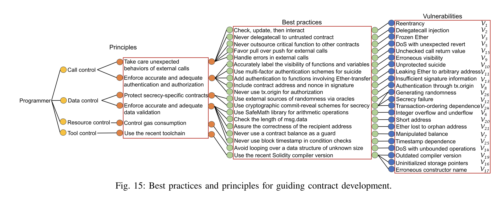
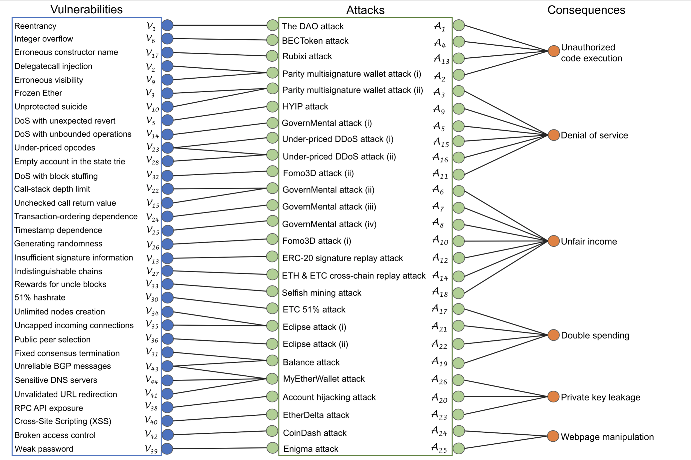
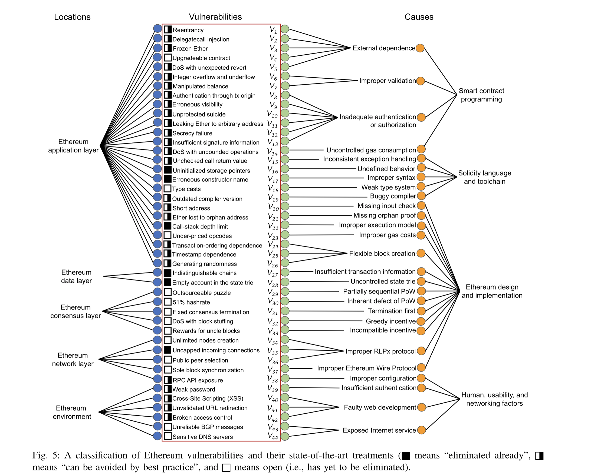

# DeFi Threat Matrix

## Abstract

This work is inspired by [attack.mitre.org](https://attack.mitre.org). Please use attack for "normal" InfoSec/Dev/Sys security check-listing, this is ment to be specialized towards the unique issues brought about in blockchain/cryptocurrency applications (i.e. protocols).

## Overview

## Overview of Threat Matrix

| **Protocol / Interaction Based** | **Blockchain Transaction Based** | **Non-Blockchain Sources** | **Blockchain Sources**     | **SWC Registry (Solidity Exploits)**                    |
| -------------------------------- | -------------------------------- | -------------------------- | -------------------------- | ------------------------------------------------------- |
| Market Attacks                   | Economic Attack                  | Off\-Chain                 | On\-Chain                  | Solidity                                                |
| Front\-Running                   | Front\-Running                   | Price Feed                 | Timestamp Dependence       | Integer Overflow and Underflow                          |
| Coordinated Attack               | Insufficient gas griefing        | Quote Stuffing             | Admin Key                  | DoS with \(Unexpected\) revert                          |
| Liquidity Pocket                 | Token Inflation                  | Spoofing                   | Timelock                   | DoS with Block Gas Limit                                |
| Quote Stuffing                   | Circulating Supply Attack        | Credential Access          | Lateral Movements          | Arithmetic Over/Under Flows                             |
| Wash Trading                     | Gas Griefing \(DoS\)             | Reentrancy                 | Multi\-Sig Keys            | Forcibly Sending Ether to a Contract                    |
| Ramping The Market               | Network Congestion \(uDoS\)      | Privilege Escalation       | Miner Cartel               | Delegatecall                                            |
| Cornering The Market             | Liquidity Squeeze                | Credential Access          | Finality                   | Entropy Illusion                                        |
| Churning                         | Smurfing                         | Encryption Protections     |                            | Short Address/Parameter Attack                          |
| Flash Loans                      |                                  | Phishing                   |                            | Uninitialised Storage Pointers                          |
| Aggregated Transactions          |                                  | Unicode Exploits           |                            | Floating Points and Numerical Precision                 |
| Bulge Bracket Transactions       |                                  | API                        |                            | Right\-To\-Left\-Override control character \(U\+202E\) |
| Layering                         | Blockchain Transaction Based     | DNS Attacks                |                            | Delegatecall to Untrusted Callee                        |
| Spoofing                         | Governance Attack                | Transaction Pool           | Transaction Pool           | Requirement Violation                                   |
| Order Book                       | Interlocking Directorate         | Checksum Address           |                            | Shadowing State Variables                               |
| Market Index Calculation Attack  | Governance Cartels               | Siphon Funds               |                            | Transaction Order Dependence                            |
| Flash Crash                      |                                  |                            |                            | Assert Violation                                        |
| Repo                             | Stalking Horse                   | Synthetic Mint Spread      | Sole block synchronization | Uninitialized Storage Pointer                           |
| Excessive Leverage               |                                  | Syscall Exploit            |                            | Unprotected Ether Withdrawal                            |
| Breaking the "Buck"              |                                  | Container Priv\. Esclation |                            | Floating Pragma                                         |
| "Fake" News                      |                                  | Keyctl missuse \(syscall\) |                            | Outdated Compiler Version                               |
| Nested Bot                       |                                  |                            |                            | Function Default Visibility                             |
| Audience of Bots                 |                                  | Influencers'               |                            |                                                         |
| Arb\. Exploit                    |                                  |                            |                            |                                                         |
| Slippage Exploit                 |                                  |                            |                            |                                                         |
| Safety Check Exploits            |                                  |                            |                            |                                                         |
| Circulating Supply Dump          |                                  |                            |                            |                                                         |
| Governance Cartel                |                                  |                            |                            |                                                         |
| Flash "Straddle"                 |                                  |                            |                            |                                                         |
| Structuring                      |                                  |                            |                            |                                                         |
|                                  |                                  |                            |                            |                                                         |
| Back\-Running                    |                                  |                            |                            |                                                         |

## Survey on Ethereum Tools and Defenses 

> source [A Survey on Ethereum Systems Security: Vulnerabilities, Attacks and Defenses](https://arxiv.org/abs/1908.04507)

 

## Overview

 

 

 

## Reactive && Proactive Defense

#### Defenses

Security enhancement
Runtime verification
Alternate languages
Contract best practices
Contract analyzer
Blockchain protocols

#### Best Practices

Check, update, then interact
Never delegatecall to untrusted contract
Favor pull over push for external calls
Never outsource critical function to other contracts
Handle errors in external calls
Include contract address and nonce in signature
Accurately label the visibility of functions and variables
Never use a contract balance as a guard
Check the length of msg.data
Use external sources of randomness via oracles
Assure the correctness of the recipient address
Never use block timestamp in condition checks
Avoid looping over a data structure of unknown size
Use the recent Solidity compiler version
Use SafeMath library for arithmetic operations
Use multi-factor authentication schemes for suicide
Add authentication to functions involving Ether-transfer
Use cryptographic commit-reveal schemes for secrecy
Never use tx.origin for authorization

## Token Mitigation

See [APPENDIX](APPENDIX.md)

##### Tags

Should tags for "potential" attacks or attacks that have been successful be utilized, and if so how implemented

### TODO

Following files have defects: 14084. 14086. 14715. 13328. 13327. 13326. 13146. 13144. 13113. 12230. 11687. 10973. 10769. 10468. 18665. 18665. 14715. 14086. 14084. 13146. 13144. 13113. 12230. 11687. 10973. 10769. 10468. 10299.

## Sheet

[DeFi Sec Matrix Sheet](https://docs.google.com/spreadsheets/d/1St4BXWpeZdcDaH5Z4nnODrerFAxfdZ4OuHofI-EbKGc/edit?usp=sharing)

[DeFi Sec Page](https://docs.google.com/spreadsheets/d/e/2PACX-1vR5UnBx4M9sg43fO76eWetena1L-4zo82lqsJuMR3uuZPe7luRnakG8jZPG0YbnSDtUOY5nVgSdwpc1/pubhtml)

- Updates to the Sheet can be found in in the 'legend' section

## License

Software Components under Mozilla Public License 2.0

CVE/SWC are licensed under their respective authors licenses.
